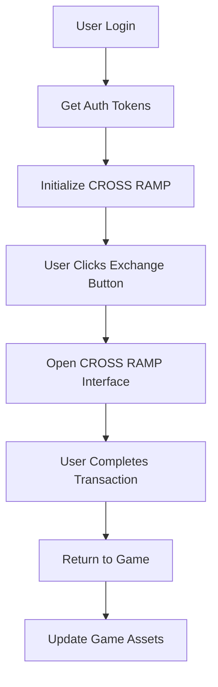

# CROSS RAMP Demo Collection

A comprehensive collection of platform-specific demos showcasing how to integrate CROSS RAMP into your games and applications. Each demo provides a complete working example with authentication, UI integration, and cross-platform compatibility.

## 🎯 What is CROSS RAMP?

CROSS RAMP is a game asset exchange platform that enables seamless tokenization and trading of in-game assets across different games and platforms. It provides:

- **Asset Tokenization**: Convert game items into blockchain tokens
- **Cross-Game Trading**: Exchange assets between different games
- **Web-Based Interface**: No SDK installation required
- **Multi-Platform Support**: Works on web, mobile, and desktop

## 📁 Demo Projects

### Available Demos

| Platform | Demo | Description | Status |
|----------|------|-------------|--------|
| **Web** | [web-ramp](./web-ramp/) | Next.js + React demo with Pong game | ✅ Ready |
| **Unity** | [unity-ramp](./unity-ramp/) | Unity 2022.3 demo with WebView integration | ✅ Ready |
| **Cocos2d-x** | [cocos2dx-ramp](./cocos2dx-ramp/) | Cocos2d-x v3 demo | 🚧 Coming Soon |
| **Unreal Engine** | [unreal-ramp](./unreal-ramp/) | Unreal Engine demo | 🚧 Coming Soon |

### Demo Features

Each demo includes:
- ✅ **Working Game Example**: Simple but functional game
- ✅ **CROSS RAMP Integration**: Complete integration with authentication
- ✅ **Multi-Language Support**: Korean, English, Chinese
- ✅ **Cross-Platform**: Desktop and mobile compatibility
- ✅ **Production Ready**: Can be customized for real games

## 🚀 Quick Start

### Choose Your Platform

1. **Web Games/Apps**: Use [web-ramp](./web-ramp/) demo
2. **Unity Games**: Use [unity-ramp](./unity-ramp/) demo
3. **Mobile Apps**: Use Unity or WebView-based demos
4. **Other Platforms**: Check individual demo READMEs

### Basic Integration Flow



## 🎮 Demo Overview

### Web Demo (web-ramp)
- **Technology**: Next.js 14, React 18, TypeScript
- **Game**: Pong with asset management
- **Integration**: Popup/redirect-based
- **Best For**: Web games, PWAs, browser-based games

### Unity Demo (unity-ramp)
- **Technology**: Unity 2022.3, C#, WebView
- **Game**: Simple asset management game
- **Integration**: WebView-based with deep linking
- **Best For**: Unity games, mobile apps, cross-platform games

## 🔧 Integration Methods

### Web Integration
```javascript
// Simple button integration
<CrossRampButton 
  projectId="your-project-id"
  accessToken="user-access-token"
  sessionId="user-session-id"
/>
```

### Unity Integration
```csharp
// Unity WebView integration
CrossRampManager.Instance.SetUserCredentials(accessToken, sessionId);
CrossRampManager.Instance.OpenCrossRamp("en");
```

### Mobile Integration
```javascript
// Mobile WebView with deep linking
<CrossRampButton 
  projectId="your-project-id"
  accessToken="user-access-token"
  sessionId="user-session-id"
  appScheme="mygame://"
/>
```

## 🔐 Authentication

### Authentication Flow
1. **User Login**: Player logs into your game
2. **Token Generation**: Your server generates CROSS RAMP tokens
3. **Client Integration**: Tokens passed to CROSS RAMP
4. **Secure Exchange**: CROSS RAMP validates and processes transactions

### Security Best Practices
- ✅ Generate tokens server-side only
- ✅ Use HTTPS for all communications
- ✅ Implement token expiration
- ✅ Validate tokens on your server
- ❌ Never expose server secrets in client code

## 🌐 Platform Compatibility

### Web Platforms
- **Desktop Browsers**: Chrome, Firefox, Safari, Edge
- **Mobile Browsers**: iOS Safari, Chrome Mobile
- **WebViews**: React Native, Cordova, Capacitor
- **PWAs**: Progressive Web Apps

### Mobile Platforms
- **iOS**: Native apps, Unity, React Native
- **Android**: Native apps, Unity, React Native
- **Cross-Platform**: Unity, Flutter, Xamarin

### Desktop Platforms
- **Windows**: Unity, Electron, Web apps
- **macOS**: Unity, Electron, Web apps
- **Linux**: Unity, Electron, Web apps

## 📱 Testing

### Test Scenarios
Each demo includes comprehensive testing:

- [ ] **Basic Functionality**: Game works correctly
- [ ] **CROSS RAMP Integration**: Exchange button opens interface
- [ ] **Authentication**: Valid tokens work, invalid tokens fail
- [ ] **Multi-Language**: Language switching works
- [ ] **Cross-Platform**: Works on target platforms
- [ ] **Deep Linking**: Returns to game after transaction
- [ ] **Asset Updates**: Game assets update after exchange

### Testing Checklist
```bash
# For each demo:
1. Run the demo locally
2. Test basic game functionality
3. Test CROSS RAMP button
4. Test authentication flow
5. Test multi-language support
6. Test on different devices
7. Test deep linking (mobile)
8. Test asset updates
```

## 🚀 Production Deployment

### Preparation
1. **Choose Demo**: Select appropriate demo for your platform
2. **Customize**: Modify UI and assets for your game
3. **Integrate**: Add authentication with your server
4. **Test**: Thorough testing on target platforms
5. **Deploy**: Deploy to production environment

### Environment Setup
```bash
# Development
CROSS_RAMP_URL=https://dev-ramp.crosstoken.io
CROSS_RAMP_PROJECT_ID=your-dev-project

# Production
CROSS_RAMP_URL=https://ramp.crosstoken.io
CROSS_RAMP_PROJECT_ID=your-prod-project
```

## 📚 Documentation

### Platform-Specific Guides
- [Web Integration Guide](./web-ramp/README.md)
- [Unity Integration Guide](./unity-ramp/README.md)
- [Mobile Integration Guide](./mobile-ramp/README.md)

### API Documentation
- [CROSS RAMP API Reference](https://api.crosstoken.io/docs)
- [Authentication Guide](https://docs.crosstoken.io/auth)
- [Webhook Integration](https://docs.crosstoken.io/webhooks)

### Best Practices
- [Security Guidelines](https://docs.crosstoken.io/security)
- [UI/UX Guidelines](https://docs.crosstoken.io/ui-guidelines)
- [Performance Optimization](https://docs.crosstoken.io/performance)

## 🛠️ Development

### Local Development
```bash
# Clone repository
git clone https://github.com/crosstoken/cross-ramp.git
cd cross-ramp/demos

# Run web demo
cd web-ramp
pnpm install
pnpm dev

# Run Unity demo
# Open unity-ramp folder in Unity Hub
```

### Contributing
1. Fork the repository
2. Create feature branch
3. Make changes
4. Test thoroughly
5. Submit pull request

## 🔍 Troubleshooting

### Common Issues

**Authentication Problems**
- Check token generation on server
- Verify token expiration
- Ensure HTTPS is used

**Integration Issues**
- Check platform-specific setup
- Verify WebView configuration
- Test on physical devices

**UI Problems**
- Check responsive design
- Test on different screen sizes
- Verify language support

### Getting Help
- [GitHub Issues](https://github.com/crosstoken/cross-ramp/issues)
- [Documentation](https://docs.crosstoken.io)
- [Discord Community](https://discord.gg/crosstoken)

## 📞 Support

### Technical Support
- **Email**: dev@crosstoken.io
- **Discord**: [CROSS RAMP Community](https://discord.gg/crosstoken)
- **GitHub**: [Issues & Discussions](https://github.com/crosstoken/cross-ramp)

### Business Inquiries
- **Partnership**: business@crosstoken.io
- **Enterprise**: enterprise@crosstoken.io
- **Sales**: sales@crosstoken.io

### Platform-Specific Support
- **Unity**: unity@crosstoken.io
- **Web**: web@crosstoken.io
- **Mobile**: mobile@crosstoken.io

## 📄 License

This demo collection is provided under the MIT License. See [LICENSE](../LICENSE) file for details.

## 🎯 Next Steps

1. **Choose Your Demo**: Select the appropriate demo for your platform
2. **Run Locally**: Test the demo on your development environment
3. **Customize**: Modify the demo to match your game's needs
4. **Integrate**: Add authentication with your game server
5. **Deploy**: Deploy to production and start using CROSS RAMP

---

**Ready to integrate CROSS RAMP into your game?** Start with the demo that matches your platform and follow the integration guide! 